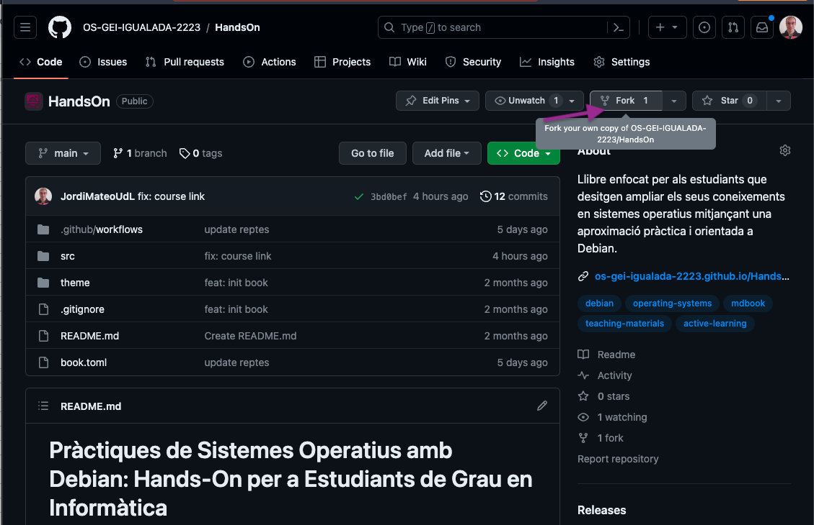
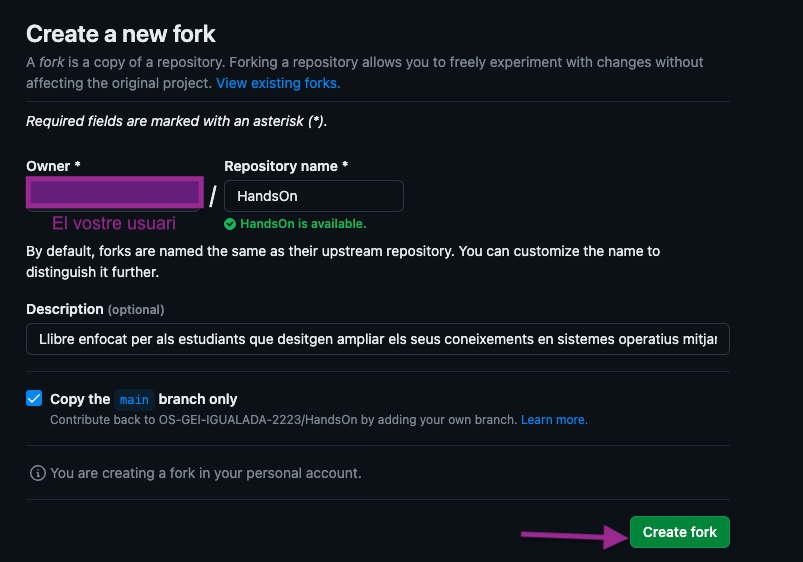
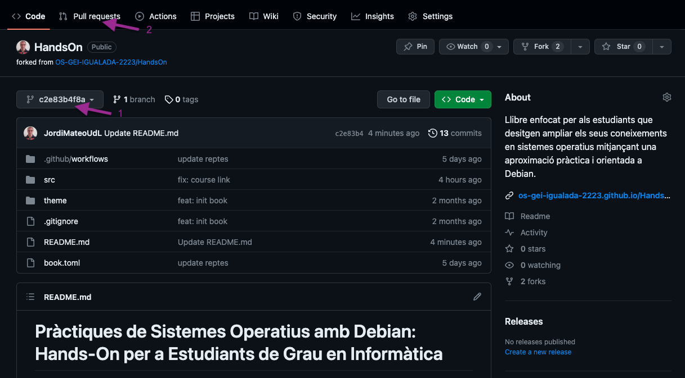
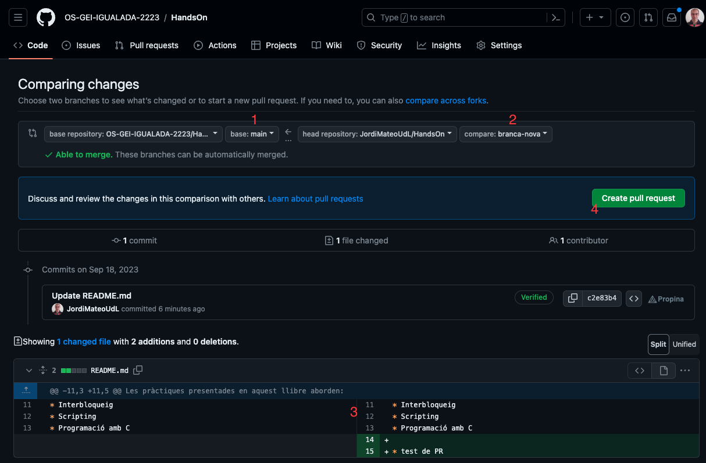

# Contribueix

Aquest material és de codi obert i podeu col·laborar-hi, complementar-lo o corregir-lo mitjançant pull requests al repositori.

## Instruccions per contribuïr

* **Fork el repositori**: Fes clic al botó **Fork** a la part superior dreta de la pàgina. Això crearà una còpia del repositori al teu compte de GitHub. Veure imatge:





* **Clona el repositori a la teva màquina**: Utilitza Git per clonar el repositori que has clonat a la teva màquina.

* **Crea una branca (branch) nova**: Abans de fer canvis, crea una branca nova on faràs les teves modificacions. Això ajuda a mantenir les coses ordenades. Utilitza la comanda següent:

```bash
git checkout -b nom_de_la_branca
```

* Fes els canvis: Realitza les modificacions necessàries en els fitxers del projecte.

* Afegeix i commiteja els canvis: Utilitza els següents comandos per afegir els canvis i fer un commit.

* Puja els canvis al teu repositori a GitHub amb la comanda següent:

```bash
git push origin nom_de_la_branca
```

* **Crea una PR**: Vés al teu repositori a GitHub i selecciona la branca on has fet els canvis. Apareixerà un missatge destacat dient que has fet una nova branca. Fes clic a "Compare & pull request" per començar la PR. 

També, pots anar a la nova branca fent click al menu desplegable i seleccionant la branca que has creat **1** i fent click al botó **New pull request** **2**. Veure imatge:



* Proporciona una descripció detallada dels canvis que has fet. A més, pots afegir captures de pantalla o informació addicional per ajudar els revisors a entendre els teus canvis. Fes clic a **New pull request** i beuras una pantalla com la següent:



**1** Indica el meu repositori (on vols enviar les modificacions) i **2** indica el teu fork (on has fet les modificacions). Assegura't de seleccionar la branca amb les modificacions **3**. Finalment, fes clic a **Create pull request** **4**.

* **Envia la PR**: Un cop hagis omplert tota la informació, fes clic al botó "Create pull request" per enviar la PR al projecte original.

## Edició del material

Per editar el material:

1. Al teu ordinador, necessitareu instal·lar  [Quarto](https://quarto.org/docs/get-started/).
2. Directament al navegador, podeu editar els fitxers `.qmd` fent clic al botó de llapis que apareix a la part superior dreta de cada fitxer. Això crearà una nova branca amb els teus canvis i et permetrà fer una PR directament des del navegador.

### 🚀 Desenvolupament local

Abans de començar, assegura't que tens [Quarto](https://quarto.org/docs/get-started/) instal·lat al teu ordinador. Obra un terminal o un IDE com VSCode i navega fins a la carpeta on tens el projecte.

Per veure una previsualització local del lloc web:

```bash
quarto preview
```

Això obrirà una previsualització local al teu navegador. La previsualització s'actualitza automàticament quan deses els canvis.

### 💻 VS Code Integration

Es pot integrar amb Visual Studio Code (VSCode) per a una millor experiència d'edició. Si no tens VSCode, pots descarregar-lo des de [https://code.visualstudio.com/](https://code.visualstudio.com/).

- **Quarto: Edició en mode visual**: Permet editar els fitxers `.qmd` en un mode visual que facilita l'ús de les funcions de Quarto.
- **Quarto: Previsualització**: Obre una previsualització del fitxer `.qmd` actual.
- **Quarto: Edició en mode font**: Torna a l'edició en mode text pla.

